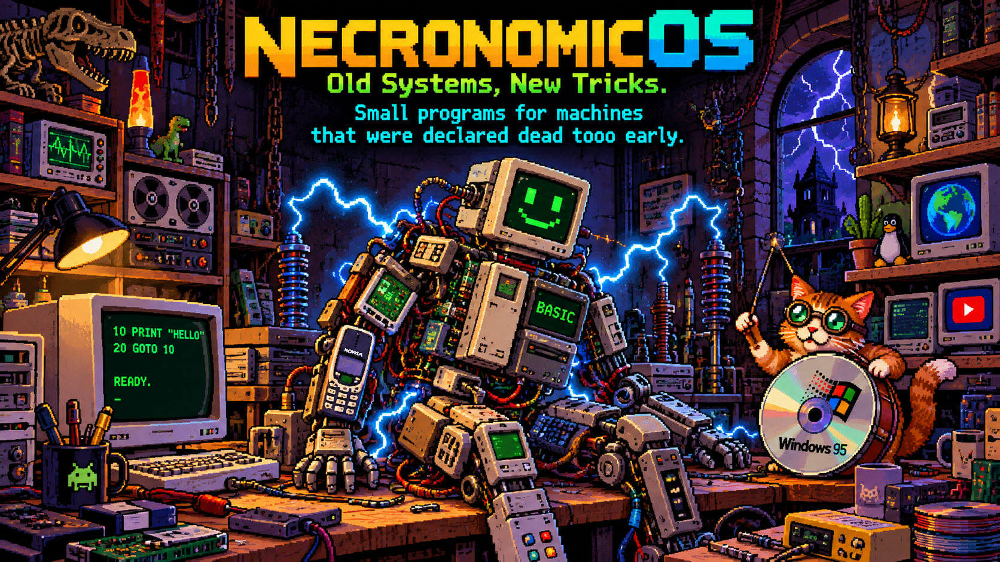

[English](#english) | [Русский](#russian)

# NecronomicOS

**NecronomicOS — Old Systems, New Tricks.**  
*Small programs for machines that were declared dead too early.*

NecronomicOS is not one operating system and not one application. It is the common name for a small workshop of experiments and practical projects built around a simple idea: **working old hardware is still hardware worth using.**

The goal is not retro computing for display and not emulation for its own sake. The goal is to find small, understandable ways to give old computers, phones and operating systems useful jobs again — and to see how much can still be done without turning every task into a modern heavyweight software stack.

## Projects

### Naive BASIC

**BASIC programming on Android — including Android 2.3 / ARMv6.**

A lightweight standalone BASIC interpreter inspired by classic BASIC and the direct programming experience of 8-bit home computers. It has its own text screen, graphics, sound, touch and keyboard input, device sensors and byte-oriented external storage.

Write a program → press `RUN` → see what happens.

**[Naive BASIC 1.0](https://github.com/ma-beast/Naive-BASIC)**

### Naive BASIC bas2apk / NaiveWORK

**BASIC → standalone Android APK, directly on Android.**

A companion tool for turning Naive BASIC `.bas` programs **and other compatible BASIC programs** into independent Android applications. The finished bas2apk 1.0 includes the NaiveWORK runtime/template and produces signed APKs without requiring a desktop development environment.

**[Naive BASIC bas2apk 1.0](https://github.com/ma-beast/Naive-BASIC-bas2apk)**

Ready games, music programs and tests for both projects are collected in **[Examples-BAS](https://github.com/ma-beast/Examples-BAS)**.

### NOS-Pipe

**YouTube for computers that the modern web has left behind.**

A lightweight Java 5 shell designed for old and weak PCs that can no longer comfortably open modern YouTube pages. NOS-Pipe keeps the interface small and delegates actual playback to an external media player, allowing machines with old Windows versions, weak processors and unusual screens to remain useful for video.

The project has been tested on Windows, macOS and Linux; its deliberately old Java baseline also leaves room for experiments on other systems.

**[NOS-Pipe](https://github.com/ma-beast/NOS-Pipe)**

### NOS-Gate

**A gateway between the modern Internet and old browsers.**

NOS-Gate sits between an old browser and today's web. It fetches modern pages, simplifies and adapts them, and gives the old machine HTML it has a realistic chance of displaying and navigating.

The project explores lightweight page modes, search handling, images, media hand-off and compatibility with browsers and systems that modern sites no longer support directly.

**[NOS-Gate](https://github.com/ma-beast/NOS-Gate)**

## Examples-BAS

The Naive BASIC family has its own growing library of real programs rather than synthetic feature lists: games, a text RPG, graphics and character-set tests, music demonstrations and a music editor written in BASIC.

**[Examples-BAS](https://github.com/ma-beast/Examples-BAS)**

## What connects these projects?

They use different languages, devices and approaches, but the working principle is the same:

> **Do not replace a working machine merely because modern software stopped caring about it.**

Sometimes the answer is a BASIC interpreter. Sometimes it is a tiny Java shell. Sometimes it is a gateway that translates today's web into something yesterday's browser understands.

The experiment itself matters too. A project does not have to become a product to answer a useful question: **can this old machine still do the job?**

## Workshop rule

**Small apps. Old hardware. Big joy.**

One small, testable step at a time. Working versions are kept working; improvements are added in reversible layers whenever possible.

**Author:** Mikhail Zverev / MA-BEAST  
**[MA-BEAST profile](https://github.com/ma-beast)**

[Русский](#russian) | [↑ Top](#top)

---

# NecronomicOS — Русский

**NecronomicOS — Old Systems, New Tricks.**  
*Small programs for machines that were declared dead too early.*

NecronomicOS — это не одна операционная система и не одна программа. Это общее имя небольшой мастерской экспериментов и практических проектов, объединённых простой мыслью: **если старое железо ещё работает, его ещё рано списывать.**

Смысл не в ретрокомпьютинге ради витрины и не в эмуляции ради самой эмуляции. Интереснее найти небольшой и понятный способ снова дать старому компьютеру, телефону или операционной системе полезную работу — и посмотреть, сколько ещё можно сделать без превращения каждой задачи в современный тяжёлый программный комплекс.

## Проекты

### Naive BASIC

**Программирование на BASIC под Android — включая Android 2.3 / ARMv6.**

Лёгкий самостоятельный BASIC-интерпретатор, вдохновлённый классическим BASIC и непосредственностью программирования на домашних 8-битных компьютерах. У него собственный текстовый экран, графика, звук, ввод с клавиатуры и сенсорного экрана, работа с датчиками устройства и внешняя байтовая память.

Написал программу → нажал `RUN` → сразу увидел результат.

**[Naive BASIC 1.0](https://github.com/ma-beast/Naive-BASIC)**

### Naive BASIC bas2apk / NaiveWORK

**BASIC → самостоятельный Android APK непосредственно на Android.**

Дополнительный инструмент, превращающий программы Naive BASIC `.bas` **и другие совместимые BASIC-программы** в самостоятельные Android-приложения. Готовый bas2apk 1.0 содержит runtime/template NaiveWORK и создаёт подписанные APK без необходимости использовать настольную среду разработки.

**[Naive BASIC bas2apk 1.0](https://github.com/ma-beast/Naive-BASIC-bas2apk)**

Готовые игры, музыкальные программы и тесты для обоих проектов собраны в **[Examples-BAS](https://github.com/ma-beast/Examples-BAS)**.

### NOS-Pipe

**YouTube для компьютеров, которые современный веб оставил за бортом.**

Лёгкая оболочка на Java 5 для старых и слабых ПК, которым уже тяжело или невозможно нормально открыть современный YouTube. NOS-Pipe оставляет интерфейс небольшим, а воспроизведение передаёт внешнему медиаплееру — благодаря этому видео остаётся доступным на старых Windows, слабых процессорах и необычных экранах.

Проект проверялся на Windows, macOS и Linux; намеренно старая база Java оставляет пространство и для экспериментов на других системах.

**[NOS-Pipe](https://github.com/ma-beast/NOS-Pipe)**

### NOS-Gate

**Шлюз между современным Интернетом и старыми браузерами.**

NOS-Gate становится посредником между старым браузером и сегодняшним вебом. Он получает современную страницу, упрощает и адаптирует её и отдаёт старой машине HTML, который она действительно способна показать и по которому можно перемещаться.

В проекте исследуются облегчённые режимы страниц, поиск, изображения, передача медиа внешнему плееру и совместимость с браузерами и системами, которые современные сайты больше напрямую не поддерживают.

**[NOS-Gate](https://github.com/ma-beast/NOS-Gate)**

## Examples-BAS

У семейства Naive BASIC есть собственная пополняемая библиотека настоящих программ вместо искусственного списка возможностей: игры, текстовая RPG, тесты графики и таблицы символов, музыкальные демонстрации и музыкальный редактор, написанный на BASIC.

**[Examples-BAS](https://github.com/ma-beast/Examples-BAS)**

## Что объединяет эти проекты?

Языки, устройства и способы решения разные, но рабочий принцип один:

> **Не выбрасывать рабочую машину только потому, что современный софт перестал о ней помнить.**

Иногда ответом оказывается BASIC-интерпретатор. Иногда — маленькая Java-оболочка. Иногда — шлюз, переводящий сегодняшний веб на язык, понятный вчерашнему браузеру.

И сам эксперимент тоже имеет смысл. Проекту необязательно становиться продуктом, чтобы ответить на полезный вопрос: **а эта старая машина всё ещё сможет?**

## Правило мастерской

**Small apps. Old hardware. Big joy.**

Один небольшой проверяемый шаг за раз. Рабочие версии не ломаем; улучшения по возможности добавляем обратимыми слоями.

**Автор:** Михаил Зверев / MA-BEAST  
**[Профиль MA-BEAST](https://github.com/ma-beast)**

[English](#english) | [↑ Наверх](#top)
